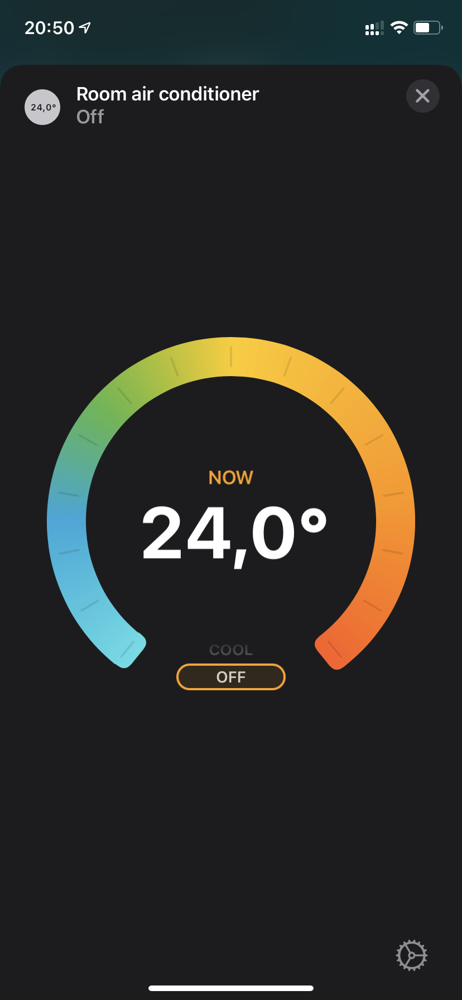
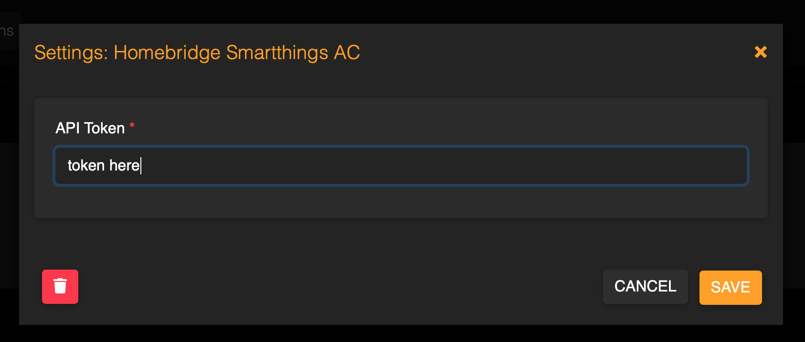

# Homebridge Smartthings AC Plugin

Control you Samsung SmartThings air conditioner with HomeKit using HomeBridge.

This plugin is not affiliated with Samsung!



## Setup the Plugin

Install the plugin by running:

    sudo npm install -g homebridge-smartthings-ac

To communicate with your SmartThings devices, you need to generate a SmartThings API token here: https://account.smartthings.com/tokens

Log in with your Samsung or SmartThings account and press `GENERATE NEW TOKEN`. Make sure to select at least the following authorized scopes for your new token:

* List all devices
* See all devices
* Control all devices 

If everything is set up correctly, the scope of your token should look something like this:

    MyToken — x:devices:*, l:devices, r:devices:*
    
The generated API token will look like `7b2c425a-13ab-4e6f-ba42-0b11d21ba6e0`. Copy this token and paste it into the plugin settings dialog in homebridge:



Finally, restart HomeBridge to reload the plugin.

## Setup Development Environment

If you want to get involved, here's how you build and install the plugin locally on your machine.

### Install Development Dependencies

Using a terminal, navigate to the project folder and run this command to install the development dependencies:

```
npm install
```

### Build Plugin

TypeScript needs to be compiled into JavaScript before it can run. The following command will compile the contents of your [`src`](./src) directory and put the resulting code into the `dist` folder.

```
npm run build
```

### Link To Homebridge

Run this command so your global install of Homebridge can discover the plugin in your development environment:

```
npm link
```

You can now start Homebridge, use the `-D` flag so you can see debug log messages in your plugin:

```
homebridge -D
```

### Watch For Changes and Build Automatically

If you want to have your code compile automatically as you make changes, and restart Homebridge automatically between changes you can run:

```
npm run watch
```

This will launch an instance of Homebridge in debug mode which will restart every time you make a change to the source code. It will load the config stored in the default location under `~/.homebridge`. You may need to stop other running instances of Homebridge while using this command to prevent conflicts. You can adjust the Homebridge startup command in the [`nodemon.json`](./nodemon.json) file.
